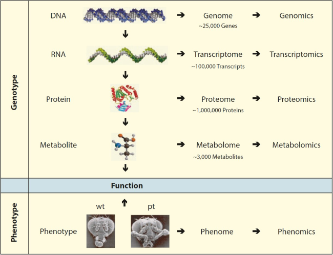

# Week 5 - Genomics and sequencing

---

**~omics**

Etymology (from Wikipedia)

**-ome** (“whole of class”) + **-ics**, both via international scientific vocabulary and New Latin ultimately from Ancient Greek

Suffix

-omics

    (chiefly biology) Forms nouns meaning “a study of the totality of something”.

This reader discusses what we call ~omics: genomics and elements of transcriptomics (namely RNA sequencing and quantification; the other parts are discussed in the book chapter).
Genomics focuses on the entirety of information that can be derived from genomes (structure, function, evolution, etc.).
Transcriptomics on the other hand focuses on the parts of the genome that are translated into RNA, with the main focus on mRNA transcribed from protein coding genes.

:::{figure} images/Week5/Fig_01_Centraldogma_nodetails.png
:alt: Central dogma
:align: right
:width: 200px
:name: w5f1

Information flow in the cell. Credits: [Narayanese at English Wikipedia - Own work, Public Domain](https://commons.wikimedia.org/w/index.php?curid=36890617)
:::

DNA is the starting point in the chain of biological information flow.
The central dogma of molecular biology was postulated by Francis Crick 1958: cellular processes allow information flow away from DNA to RNA and then to proteins, not the other way around ({numref}`w5f1`).
From DNA we progress through transcription and translation towards whole organisms and their phenotypes.
So, it is fitting to start at the beginning.
Even before people knew about DNA and its role as keeper of hereditary information, they were aware that parental characteristics are inherited by offspring.
Around 1866 Gregor Mendel was the first to perform detailed experiments testing heritability.
He first described 'units of heredity', later named genes.
Today, we know that genes are encoded in the DNA in our cells.
Our understanding of genes has expanded to a more complex concept, focused on stretches of DNA coding for proteins or RNA.
The term genome was originally used to describe all genes in an organism or cell, but now refers to the full DNA content of a cell.

(w5box1)=
:::{admonition} Box 1: The Human Genome Project
The goal of the Human Genome Project (HGP) was to sequence and annotate all genes in the human genome.
The project formally started in 1988, although sequencing did not start until around 1990.
During the first stages, technology development played an important part and led to the development of techniques such as PCR (polymerase chain reaction), gel electrophoresis and other radically new lab protocols.
The human genome was completely sequenced with Sanger sequencing technology (which is described below) and a first draft genome, covering 90% of the estimated 3.2 billion base pairs) was published in Nature in 2001, with a final genome in 2003.
One of the most surprising findings was that the human genome only contained roughly 20,000 genes, far less than the estimated 50,000-140,000.
The entire project is estimated to have cost [\$3 billion](https://www.genome.gov/about-genomics/educational-resources/fact-sheets/human-genome-project).
In 2021 the first true telomere-to-telomere assembly of the human genome was assembled using the third generation technologies described below: PacBio, Oxford Nanopore and Hi-C.
:::

## The history of genome sequencing

The first genomes sequenced were those of the Phi X bacteriophage in 1977 and the Epstein-Barr virus in 1983.
The first bacterial genome, *Haemophilus influenzae*, was sequenced in 1995, followed by the first archaeal genome sequence of *Methanococcus jannaschii* in 1996.
In the same year followed the first eukaryotic genome, that of *Saccharomyces cerevisiae* (baker’s yeast).
*Escherichia coli*, the main bacterial model organism, was sequenced in 1997.
Sequencing of the human genome started already in 1988 and was officially finished in 2003 ({numref}`w5f2`) and [Box 1](w5box1)).

:::{figure} images/Week5/Fig_02_timeline_01626.png
:alt: History of genome sequencing
:align: center
:name: w5f2

History of genome sequencing and the Human Genome Project.
:::

The project was very costly, with an estimated cost of \$2.7 billion.
In comparison, it is nowadays possible to sequence all variants between a human genome and the reference for less than \$1,000 on Illumina’s NovaSeq machine.

## Genomes

:::{figure} images/Week5/Fig_03_specific_genome_sizes.jpg
:alt: Gene content table
:align: center
:name: w5f3

Gene content in some representative species. From: Greg Gibson, A Primer of Genome Science, 3rd ed.
:::

With the rapid evolution of sequencing technology, our understanding of genomes and their content has grown as well.
We now know that genomes vary greatly in terms of size, chromosome numbers, and ploidy ({numref}`w5f3`), as well as gene content ({numref}`w5f4`).
Genome sizes range from 100kb in bacteria to more than 100Gb (Giga basepairs) in plants.
Humans have a genome size of 3.2Gb.
Not only the genome size varies greatly, in eukaryotes the number of chromosomes and chromosomal copies (ploidy) do too.
Chromosome numbers range from 4 in fruitfly (*Drosophila*) to 23 in human to 50 in goldfish and 100+ in some ferns. Similarly, ploidy ranges from haploid (single set of chromosome(s), ploidy of N) and diploid (two copies, ploidy of 2N) to polyploid (more than 3 copies), with at the extreme end ferns with ploidy levels of over 100.
Gene numbers also vary per species; at the low end, bacterial endosymbionts have 120+ genes, whereas most higher eukaryotes (including humans) have between 15,000 and 25,000 genes and some plants can have more than 40,000 genes – rice has over 46,000.

:::{figure} images/Week5/Fig_04_Genome_Sizes.png
:alt:
:align: center
:name: w5f4

Left, variety of genome sizes [Abizar at English Wikipedia, CC BY-SA 3.0](https://commons.wikimedia.org/w/index.php?curid=19537795); right, examples of ploidy [Haploid_vs_diploid.svg: Ehambergderivative work: Ehamberg (talk) - Haploid_vs_diploid.svg, CC BY-SA 3.0](https://commons.wikimedia.org/w/index.php?curid=13308417)
:::

(w5box2)=
:::{admonition} Box 2: Size does(n’t) matter?
Genomes come in all shapes and sizes.
The smallest known (non-viral) genome is that of the bacterial endosymbiont *Nasuia deltocephalinicola*, which only consists of 112,091 nucleotides encoding 137 proteins.
The largest genomes known to date are marbled lungfish and the plant *Fritillaria assyriaca* with 130,000,000,000 nucleotides (130Gb), although the amoeboid *Polychaos dubium* is purported to have a genome size of 670Gb.
Genome size is not necessarily correlated with the number of genes in the genome (see also {numref}`w5f3`).
Number of protein coding genes in turn is not correlated entirely with organism complexity.
:::

### Genome sequencing technologies

The process of generating a genome starts with DNA sequencing, the detection of nucleotides and their order along a strand of DNA.
Conceptually, there are three ways of sequencing:

* Chemical sequencing relies on step-by-step cleaving off the last nucleotide from a chain and identifying it.
Mainly due to the use of radioactive labels, this method was nevery widely used.

* Sequencing-by-synthesis involves synthesizing a complementary strand base by base and detecting insertion at each position.
This is currently the most widely used method, and various implementations are available.
It is also referred to as Next-Generation Sequencing (NGS).

* Direct sequencing involves directly measuring the order of nucleotides in a strand of DNA, which has only recently become feasible and is thus far only implemented in Oxford Nanopore sequencing.

Some sequencing devices and their capabilities in terms of read length and yield per run are shown in {numref}`w5f5`.

:::{figure} images/Week5/Fig_05_developments_in_high_throughput_sequencing.jpg
:alt: Sequence technology evolution
:align: center
:name: w5f5

Sequencing technology, with yield per run vs. read length. Note the logarithmic scales. Multiple dots per technology indicate improvements in read length and/or yield due to upgrades. This figure is already outdated with higher yields produced by the Illumina Novase and longer reads by both Oxford Nanopore MinION/PromethION and Pacbio Sequel II devices. Credits: Nederbragt, Lex (2016): developments in NGS.
:::

#### Sanger sequencing

Sanger sequencing was the first 'high-throughput' method of DNA sequencing.
Developed in 1977 by Fred Sanger and colleagues, the protocol was first largely manual until it was automated in 1985 by Applied Biosystems.
Sanger sequencing uses the chain-termination method ({numref}`w5f6`).

:::{figure} images/Week5/Fig_06_Sanger-sequencing.svg
:alt: Sanger sequencing
:align: center
:name: w5f6

Chain termination (Sanger) sequencing. Credits: Estevezj - Own work, CC BY-SA 3.0
:::

In a first step, that is universal to all sequencing techniques, genomic DNA is purified and sheared into fragments of the desired length.
For Sanger sequencing the fragment length is around 1,000 nucleotides.
Shearing is done either mechanically or chemically, and resulting fragments are not all exactly equally long: they are distributed around the target fragment size.

:::{figure} images/Week5/Fig_07_Sanger_sequencing_read_display.png
:alt: Sanger sequencing signal
:align: center
:name: w5f7

Sanger sequencing signal, with low quality bases at the start of the read
:::

Template DNA fragments are amplified in a PCR reaction using a primer and DNA polymerase.
Each sample is amplified in 4 separate reactions, one for each nucleotide (A, T, C, G).
In each of these reactions, a small proportion of modified nucleotides (ddNTP) is added to the normal nucleotides (dNTP).
These modified nucleotides are designed to stop the elongation of the strand and are linked to a label by which they can be identified.
This leads to a collection of partially amplified fragments of template DNA.
The length of each fragment was originally measured by the distance the fragment travelled on a gel, in later setups by the time it took to pass through a capillary.
The label on the last nucleotide then identifies the base at a given position and a peak pattern is generated.
From a signal of peak patterns ({numref}`w5f7`), the sequence can be read off automatically.
Sanger sequencing produces read lengths between 700-1,000 nucleotides; after this, the quality of the base calling drops too far to be useful.
The quality at the beginning of a read is generally too low to be used ({numref}`w5f7`).
Another problem with Sanger sequencing is the detection of homopolymers (the same nucleotide occurring multiple times), as the peak height of the signal decreases the longer the stretch is.
This makes it difficult to differentiate between 3, 4 and 5 nucleotides of the same base.

Sanger sequencing was the main sequencing platform until around 2007.
From 2004 onwards, it was increasingly superseded by the what we call next-generation sequencing (NGS) methods.
Today it is still used, among others to sequence PCR products to validate variants, to determine the orientation of genes in cloned vectors, or in microsatellite studies.

#### Next generation sequencing

Next-generation sequencing (NGS) technologies allow much higher throughput at far lower cost than Sanger sequencing, although it comes at a price: shorter reads and lower base-calling accuracy.
Where Sanger sequencing machines could sequence 96 fragments simultaneously, these newer devices now produce billions of reads per sequencing run.
Describing all of these methods in detail is beyond the scope of this course.

As with Sanger sequencing, NGS methods rely on amplification of a library of input DNA fragments to enhance the signal of the actual sequencing step.
Most sequence data is nowadays generated by Illumina technology (or 3rd generation methods, see the next section) which allows for massive parallel sequencing of reads.
A schematic overview of the steps required for sequencing is given in {numref}`w5f8`.
Illumina sequencing uses bridge-amplification, where the PCR reaction takes place directly on a flow-cell surface.
In the library preparation step ({numref}`w5f8`A), a forward and reverse adapter are ligated to the ends of a single strand template fragment.
The complementary sequences for the adapters are ligated to a flow-cell as PCR primers.
The initial template sequence (with adapters) will then form a double stranded bond with one of the primers on the flow-cell surface ({numref}`w5f8`B).
The fragment is next copied in a standard PCR reaction, but with the end firmly attached to the surface.
The DNA is denatured to go from double stranded to single stranded again and the original template is washed away, leaving a single fixed copy.
The end of that strand can then form a bridge with a neighbouring empty primer of the other end and the reaction is repeated, ending in first two fixed fragments and subsequently thousands of identical fragments near each other.
In the sequencing step ({numref}`w5f8`C), a final PCR then uses fluorescent dye terminated NTPs, which are washed across the surface in each cycle.
A camera detects the colour, the dye is cleaved off and the steps are repeated for the length of the sequencing reaction.

:::{figure} images/Week5/Fig_08_final.png
:alt: Illumina sequencing
:align: center
:name: w5f8

The process of Illumina sequencing. The Illumina NovaSeq uses a system of 2 fluorescent dies compared to the traditional 4. This greatly speeds up sequencing
:::

Illumina reads can be sequenced from one primer end only, which yields so-called single end reads, or from both primer ends, which gives paired end reads, i.e.
two reads that originate from the same molecule with a distance that is approximately known.
The read length is set by the protocol and ranges between 30 to 2x350 nucleotides.
The number of clusters of amplified fragments on a flow cell ranges from millions to billions.

Illumina reads are cheap, short and highly accurate.
One issue is that fragments with extreme GC content are less likely to be sequenced, which can lead to incomplete genome assemblies or coverage.

#### 3rd Generation sequencing

After the success of NGS, alternative so-called 3rd generation technologies were introduced to overcome some of the shortcomings, mainly the limited read length.
All produce longer reads at lower yields, and generally have a higher error rate than the methods described previously.

The most established method is PacBio single molecule real time (SMRT) sequencing.
Compared to other methods it does not include a PCR step to amplify the signal of the template DNA.
Instead, it makes clever use of the structure of SMRT-cells to amplify the light signal of bases being incorporated with the use of a laser.
A circularised double stranded piece of template is loaded into tiny wells on a SMRT-cell, with the aim of having a single molecule in each well.
Incorporation of nucleotides is signalled by cleavage of a phosphorescent molecule from the nucleotide and recorded with a camera.

One major difference with NGS is that the template is circular instead of linear, and that a single template can thus be sequenced multiple times consecutively in what is called circular consensus sequencing (CCS).
In general 3rd generation sequencing techniques suffer from a higher error rate, with most errors being indels, short insertions or deletions.
This has implications for e.g. mapping and assembly.
Making use of the CCS allows for proofreading and higher accuracy ({numref}`w5f9`), with the most recent PacBio HiFi reads reaching 99% read accuracy.

:::{figure} images/Week5/Fig_09final.png
:alt: PacBio sequencing
:align: center
:name: w5f9

PacBio sequencing library construction and circular consensus sequencing
:::

The read length of this technology is determined by the size of the input fragment and the length of time the polymerase functions (the high-energy laser light slowly degrades the enzyme over time).
Median read lengths vary between 15,000 and 20,000 nucleotides for CCS reads and up to 175,000 nucleotides for continuous long read sequencing.
PacBio sequencing has no amplification bias like other technologies (there is no PCR step) and is least influenced by GC-content.
Overall, it gives the most uniform coverage across a genome sequence.
Unfortunately, it also has much lower throughput than e.g. Illumina sequencing and a still significantly higher price per base.

:::{figure} images/Week5/Fig_10_final.png
:alt: Oxford Nanopore MinION
:align: center
:name: w5f10

Oxford Nanopore MinION sequencer (left) and a nanopore with DNA and the generated signal (right)
:::

<iframe width="560" height="315" src="https://www.youtube.com/embed/RcP85JHLmnI" title="YouTube video player" frameborder="0" allow="accelerometer; autoplay; clipboard-write; encrypted-media; gyroscope; picture-in-picture; web-share" allowfullscreen></iframe>

The newest technology is nanopore sequencing, currently provided by Oxford Nanopore on the MinION and related devices ({numref}`w5f10`).
This technology is completely different to any of the others, in that it directly detects the order of nucleotides of a DNA strand being pulled through a protein nanopore by measuring the changes in current across the membrane the nanopore is embedded in.
The flow-cell in nanopore sequencing has a number of wells.
Each of these wells has a sensor at the bottom that detects currents.
The well itself is covered by a membrane, similar to a cell membrane, although in this case it is not a lipid bilayer but a more stable polymer.
Embedded in this membrane are transmembrane protein pores (genetically modified to work optimally) through which a DNA molecule fits.
A current potential is applied between the top and the bottom of the membrane and, as DNA is negatively charged, it wants to travel through the pore.
This changes the electrical resistance, which is detected by the sensor.
A problem is that the DNA travels too fast for the sensor to detect the nucleotides; the solution is to add a DNA-polymerase, that acts as a brake (denoted in {numref}`w5f10` as motor, as it actively unzips the DNA).
The polymerase itself does not fit through the pore and sits on top of it.
As with PacBio, the read length is determined by the input DNA fragment size and has no theoretical limit: the current read length record stands at 4.2 Mb, which is enough to sequence a bacterial genome in one go.
Nanopore sequencing has a similar error model as PacBio, with insertions and deletions most prevalent and accuracy limited to between 85 and 95%, although accuracy is improving.
The main advantage over any of the other technologies is that the template DNA itself is measured, so base modifications like DNA methylation can be detected as well.
The sequencer is also small enough to fit in a pocket and people have used it in various non-traditional conditions, such as arctic expeditions on Svalbard and in the International Space Station.

#### Quality control

As discussed above, sequencing technology is not perfect and errors will be present in the output.
Moreover, what we sequence is not always what we originally intended to sequence ({numref}`w5f11`).

:::{figure} images/Week5/Fig_11_from_Doc_Picture8.png
:alt: Sequencing contamination
:align: right
:name: w5f11

Causes for contaminated sequencing samples, using as example the tardigrade and surrounding bacteria
:::

Sources of errors related to sequencing itself are base calling errors (substitution errors), uncalled bases (indels), GC bias, homopolymers, a drop of quality towards the 3’end of a read, and duplicates (amplification bias).
Additional error sources are contamination of the input sample, remnants of adapters and sequencing vectors.
It is therefore important to assess the quality of the sequencing itself and the output data before further analysis.

### Genome assembly

When no reference genome is available for a species, we need to assemble one, i.e. build one from scratch by putting together DNA sequence reads.
Here we discuss what to do when a reference genome sequence is not yet available.
First, we examine why we would want to create a reference assembly, and what types of references can be created.
Next, the assembly process and its challenges are introduced.
Finally, genome annotation and detection of structural variation are discussed.

#### Reference genome quality

:::{figure} images/Week5/Fig_12_Picture9.svg
:alt: Co-segregation of alleles
:align: center
:name: w5f12

Co-segregation of alleles
:::

Genomes can be reconstructed with different aims, which influence the required quality of the final assembly.
The human genome, for example, has been assembled as far as possible and in 2021 the first telomere-to-telomere assembly was published {cite:p}`t2t_human_genome`, adding the final 5% of bases.
It has taken enormous effort, both in terms of finance and labour, to get to this stage.
This is neither feasible nor strictly necessary for each genome assembly project.
Hence, most genome assemblies currently available are so-called draft assemblies, and most fully completed genomes are from bacteria and other species with small genomes.
In terms of the assembly process, for eukaryotic genomes the euchromatic regions assemble easiest.
Fortunately, these regions contain most of the genes, making draft assemblies useful for studying mutations or expression patterns.
When we want to study larger features of the genome itself however, such as co-segregation of alleles ({numref}`w5f12`) or gene order ({numref}`w5f13`), we need more contiguous assemblies.
3rd generation sequencing, scaffolding and newer technologies such as chromatin conformation capture (Hi-C) etc.
make chromosome-level assemblies increasingly attainable.

:::{figure} images/Week5/Fig_13_41587_2015_Article_BFnbt3103_Fig2_HTML.png
:alt: Salmonella typhi chromosomal resistance island
:align: center
:name: w5f13

Genetic representation of the *Salmonella typhi* chromosomal resistance island
:::

### Genome assembly strategies

In the early days of DNA sequencing, generating sequencing reads was very costly.
Much effort was therefore spent on developing methods requiring a minimum amount of sequence data to assemble a genome.
Moreover, Sanger sequencing requires all fragments of DNA in a run to be identical, so some form of organising the DNA was required.
This was initially done by sequencing the start of a single large fragment (much longer than the read length), and generating sequencing primers from the end of the sequenced part for the next round of sequencing, until the end of the fragment was reached.
This rather tedious approach was not feasible for larger genomes.
This led to the development of the whole genome shotgun sequencing method, made possible by the growth in compute power for assembly.
With the advent of 2nd generation sequencing, this was updated by leaving out the cloning step.
2nd generation sequencing technology (e.g. Illumina) allows for a mixture of fragments to be sequenced at the same time and the volume of sequencing data generated is large.
So instead of requiring lab work to select which section to sequence, everything is sequenced at once and the puzzle is solved later by computer.

#### Whole genome sequencing

Nowadays, the most widely employed genome sequencing approach is whole genome sequencing (WGS, {numref}`w5f14`).
As the term implies the whole genome is sequenced, without discrimination.
DNA is extracted from cells and sheared into random fragments.
These fragments are then size selected and sequenced using Illumina, PacBio or Oxford Nanopore technology.
Note that WGS generally generates draft genome assemblies; additional steps are required to gain a complete, high-quality reference genome assembly.

:::{figure} images/Week5/Fig_14_WGS.png
:alt: WGS using short reads
:align: center
:name: w5f14

Whole genome sequencing and assembly using short reads
:::

#### Assembly challenges

The main challenge of assembly is to reconstruct the original genome sequence from the millions or billions of small fragments.
Some people have likened this process to putting a stack of newspapers (each newspaper representing one copy of the genome) through a shredder and attempting to reconstruct a single original newspaper from the resulting confetti.
Solving this puzzle has driven the development of dedicated assembly algorithms and software.
Any computational approach has to overcome the real-world challenges posed by the sequenced data and the characteristics of genomes.

:::{figure} images/Week5/Fig_15_from_slide.png
:alt: The assembly problem as a jigsaw puzzle
:align: center
:name: w5f15

The assembly problem as a jigsaw puzzle
:::

If we look at a genome assembly using the analogy of a jigsaw puzzle ({numref}`w5f15`), the challenges become obvious:

* There is no picture on the puzzle box, i.e. we have no idea what the assembled genome is meant to look like. 
We can look at related genomes, but this will only give an approximate idea.

* There are loads of pieces in the puzzle, billions of them. 
Every piece represents a small part of the genome that has been sequenced.

* Some pieces are frayed or dirty, i.e. reads contain errors, further obfuscating the overall picture.

* Some pieces are missing. 
Some parts of the genome do not break as easily as others, and are not included in the sheared fragments. 
Other have extreme GC values and do not amplify as well in the PCR step.

* Some parts of the puzzle contain the same image. 
In genome terms, these are duplicated regions, where some genes may have more than one copy. 
For example, the ribosomal RNA cistron (the region which encodes the parts of the ribosome) consists of multiple copies.

* Some parts of the puzzle look completely identical and are featureless, like blue sky: the repeat regions.

* In circular genomes, there are no “corners”: we do not know where the genome begins or ends.

In addition to the metaphors of the single puzzle, many organisms contain two (i.e. diploid) or more (i.e. polyploid) copies of the same chromosome, with small differences between them.
In essence, in this case we try to assemble one puzzle from two (or more) slightly different versions.
If these differences grow too big, parts from the two puzzles may be assembled independently without noticing (remember - we have no puzzle box!).

With long high-quality reads this puzzle challenge becomes simpler, as there are fewer pieces in total and fewer only blue-sky parts.
Currently, chromosome-level assemblies are routinely generated using PacBio HiFi reads in combination with Hi-C.

##### Repeats

Repeat regions (i.e. the blue sky) are the main challenge in genome assembly and most contigs (contiguous sequences, the longest stretches that can be assembled unequivocally) stop at the edges of repetitive regions.
The process is like finding many puzzle pieces containing both bits of stork and blue sky, and trying to figure out which edge belongs to which stork and how much blue sky goes in between.
One solution for solving the repeat problem are longer reads (that can bridge the blue sky between two storks) To illustrate the scale of the problem that repeats pose in assembly: most mammalian Y-chromosomes have not been assembled for more than 50%, because of the repeat content.

#### Assembly quality assessment

When assembling a new genome, we have no way of verifying its quality against a known ground truth.
We also rarely get a complete genome or chromosome as a single contig or scaffold as a result.
Therefore, other metrics and methods are required to assess the quality of an assembly.
We can use the experience gained in other assembly projects to gauge the quality of an assembly; we can compare it to closely related genomes that have already been assembled; and we can compare the assembly with the expectations we have about the genome in terms of overall size, number of chromosomes and genes, given the known biology of the species.

#### Insights from complete genomes

The contiguity and completeness of an assembly determines what we can learn from them.
In the reference genome section, co-segregating alleles and gene order were already mentioned.
If a genome is assembled in fewer, larger pieces (i.e. longer contigs), we can also understand more about the long distance regulatory elements that play a role in regulation of gene expression ({numref}`w5f16`).

:::{figure} images/Week5/Fig_16_from_Doc_Picture12.png
:alt: Regulatory elements
:align: center
:name: w5f16

Examples of long-distance regulatory elements and their distances to the target gene identified in the human genome
:::

As discussed above, the telomere-to-telomere assembly of the human genome added the 5% hitherto missing genome sequence.
While the previous human genome assembly was already considered gold standard and very complete, the number of genes increased with 5%, of which 0.4% were protein coding.
This increase in identified genes also allows the study of expression patterns of these genes.
An increase in genome coverage can also reveal hidden elements: {numref}`w5f17` shows all paralogs of a disease related gene that have finally been resolved.
Most of the missing copies were in hard to sequence parts of the genome.
Chromosome-level assemblies also allow us to study genome evolution itself, the way chromosomes are rearranged during evolution and speciation.

:::{figure} images/Week5/Fig_17_final.png
:alt: Resolved paralogs thanks to genome coverage
:align: center
:name: w5f17

Shows the protein-coding gene *FRG1* and its 23 paralogs in CHM13. Only 9 were found in the previous assembly (GRCh38). Genes are drawn larger than their actual size, and the "*FRG1*" prefix is omitted fro brevity. All paralogs are found near satellite arrays. *FRG1* is involved in acioscapulohumeral muscular dystrophy (FSHD). Adapted from ...
:::

## Variants

(w5box3)=
:::{admonition} Box 3: Phenotypic variation
Small variants can have large phenotypic effects.
They account for the large variation in things all around us.
In food products, variants have been actively selected for to create the wide varieties of shapes, colour and taste we see in our food items today.
Historically, variants have been selected purely on these visible phenotypes and new ones have been created mainly by chance in large-scale crosses.

{w=200px align=right}

Nowadays genetic information obtained through genome sequencing and variant calling is used more and more in plant and animal breeding and selection.
:::

Mapping reads to a reference is a means to an end.
As stated above, one of the main goals is to detect genomic variation.
Such variation can help explain phenotypic variation (see [Box 3](w5box3)).
Genomic variation between samples, individuals and/or species can also be used to study evolutionary history (see also weeks 2 and 3, on multiple sequence alignments and phylogeny).

Variants are divided into two main groups: structural or large-scale variants and small-scale variants.
Here, we focus on small-scale variants.
Within this group we distinguish single-nucleotide polymorphisms (SNPs), multiple nucleotide polymorphisms (MNPs) and small insertions and deletions (indels):

:::{figure} images/Week5/Fig_INDELS_Picture14.svg
:alt: Indels
:align: center
:::

Each variant at a particular position of a reference genome is called an allele.
In our example of a SNP above, we have a reference allele T and an alternate allele G.
When a sample originates from a single individual, the theoretical number of alleles at any position of the reference cannot exceed the ploidy of that individual: a diploid organism can at most have two different alleles (as in our example), a tetraploid can at most have four, etc.
Given that we only have four different nucleotides, the maximum number of possible alleles for a single position is four, for higher ploidy alleles get complicated.
But if we find more than two alleles in a diploid organism it must be the result of an error, either in the read or in the reference.

### Variant calling

As we have already seen, variants can be real, they can be the result of sequencing errors, or represent errors in the reference sequence.
The process of detecting variants (SNPs and indels) and determining which are real or most likely errors is called variant calling.
To indicate the probability that a variant is real, a quality score is assigned to each variant.
This considers the read depth and the mapping quality at the position of a putative variant.
Variant calling software will also report, among a whole host of statistics, the so-called allele frequency (AF), determined by the number of reads representing each allele that map.
In a diploid organism with one reference allele and one alternate allele we expect both, on average, to have a frequency of 0.5.
When the frequency of one allele is close to 0, it is an indication that this variant is most likely due to an error.

### Variants and their effects

:::{figure} images/Week5/Fig_18_final.png
:alt: Flower color SNP
:align: center
:name: w5f18

The main features of the *bHLH* gene and its expression products (not to scale). In Caméor, a white flowered pea cultivar of genotype *a*, there is a single G to A mutation in the intron 6 splice donor site that disrupts the GT sequence required for normal intron processing. In the DNA, exons 6 and 7 are shown as grey boxes that flank the intron 6 splice donor and acceptor sequences. In the RNA, the vertical lines represent exon junctions, and the light grey box represents the 8 nucleotide (nt) insertion in the *a* mRNA that results from mis-splicing of intron 6. The red stars show the position of the stop codon in the predicted protein, highlighting the premature termination in the white flowered cultivar.
:::

SNPs between individuals underly most phenotypic variation.
Sometimes a single variant causes a different phenotype, like the classical mendelian trait of flower color ({numref}`w5f18`).  More often phenotypic traits are the result of multiple variants, one example is height.
Some variants can cause hereditary defects or increase the risk of certain diseases.
Well-studied examples are mutations in the BRCA1 and BRCA2 genes ({numref}`w5f19`).
A specific mutation in the BRCA1 gene increases the chance for that person to develop breast cancer during their lifetime to 80%.

:::{figure} images/Week5/Fig_19_BRCA_joc15119f1.png
:alt: BRCA genes
:align: center
:name: w5f19

Variants in BRCA1 and BRCA2 genes involved in cancer. From @doi:10.1001/jama.2011.1456
:::

### Large-scale genome variation

Above, we discussed small scale variants such as SNPs and indels.
In contrast, large-scale variants are structural variants where parts of genomes have been rearranged, duplicated or deleted ({numref}`w5f20`).
A special case is copy number variation, where genes (or exons) have been duplicated.

:::{figure} images/Week5/Fig_20_Mutation_UPDATED.jpg
:alt: Structural variants
:align: center
:name: w5f20

Different types of structural variants on chromosome level
:::

(w5box4)=
:::{admonition} Box 4: Cri du chat syndrome

Cri du chat syndrome is a genetic disorder that is caused by the partial deletion of the short arm of chromosome 5.
Babies suffering from the condition have a high pitched cry that sounds similar to a cat, which has given the condition its name.

Furthermore, they suffer a.o. from delayed growth and poor reflexes.
:::

### Structural variation

Structural variants are variations that are larger than approximately 1kb in size, which can occur within and between chromosomes.
Structural variants have the potential to have major influence on phenotypes, such as disease, but that is not necessarily the case.
Structural variants do appear to play a large role in the development of cancerous cells.

#### Copy number variation

Copy number variants (CNVs) are a special case of structural variants where the number of times a gene occurs on the genome changes.
In a diploid organism, a deletion will leave only one copy, whereas a duplication can result in three or more copies of the gene in an individual.
Changing the copy number can be part of normal variation in a population, e.g. genes involved in immune response vary in copy number; but, more often than not, copy number variation leads to severe phenotype changes, such as diseases in humans.

#### Detection of structural variants

Accurately detecting structural variation in a genome is not easy.
The challenge lies in detecting the edges of the variants (i.e.
breakpoints) and, in case of duplications/insertions/deletions, the resulting copy number.
When a mapping-based approach is used (possible if the reference genome is known) we can use read depth and paired end reads to detect variants.
In the case of a gene duplication we expect more reads to map to the single copy of the reference genome than expected.
More copies of the gene in the sample will result in more reads from that gene ({numref}`w5f21`).
Conversely, coverage is expected to drop when one copy of a gene is lost.

:::{figure} images/Week5/Fig_21_12859_2008_Article_2810_Fig5_HTML.jpg
:alt: Gene duplication creates coverage challenges
:align: center
:name: w5f21

Gene duplication results in higher coverage than expected in the duplicated regions
:::

Orientations of paired end reads as well as split reads are a good indicators to detect the boundaries of inversions, but also substitutions and translocations.
The rearrangements will result in one read from a pair to map to one genomic location and the other read to another location.
Reads from the break point will be split in the alignment.

#### Examples of structural variants and CNVs

:::{figure} images/Week5/Fig_22_final.png
:alt: Inversion leading to phenotypic variation in ruffs
:align: center
:name: w5f22

Orientation of the inversion in the three male morphs
:::

Large chromosomal inversions play a role in within-species phenotypic variation and have also been found as the result of introgression after hybridisation of two different species.
One example of a within-species inversion yielding large phenotypic differences are the three male morphs in the ruff (*Calidris pugnax*, {numref}`w5f22`).

:::{figure} images/Week5/Fig_23_from_Doc_Picture17.svg
:alt: Phenotypic differences in butterflies due to inversions
:align: center
:name: w5f23

At least two genetic inversions are associated with the *Heliconius numata* supergene. The ancestral gene order, which matches that in *H. melpomene* and *H. erato* is shown on the left and is associated with ancestral phenotypes such as *H. n. silvana*. Two sequentially derived inversions are associated with dominant alleles and are shown in the middle and right. Adapted from ...
:::

Another example is the acquisition of an inversion containing genes for wing color patterns in different species of Heliconius butterflies ({numref}`w5f23`).
Copy number variation can also affect phenotypic traits with an example being flowering time, photoperiod sensitivity and height of wheat plants ({numref}`w5f24`).

:::{figure} images/Week5/Fig_24_122_2013_2177_Fig2_HTML.png
:alt: Graphs showing impact of gene copy number on phenotypes
:align: center
:name: w5f24

Gene CNV contributes to wheat phenotypic diversity. a) CNV of *Vrn-A1* gene controls flowering time by affecting vernalization requirement; b) CNV of *Ppd-B1* controls flowering time by affecting photoperiod sensitivity; c) CNV of *Rht-D1b* gene (a truncated version of *Rht-D1a*) determines severity of plant dwarfism phenotype. In all three cases, the impact of gene copy number on observed phenotype has been verified experimentally. Sources: ...
:::

## Transcriptomics

Transcriptomics is about understanding expression of genes (i.e.
the levels of transcription of genes on the genome to RNA).
RNA and its role in the cell has already been discussed in week 1.
If you want to know what other types of RNA exist outside the common mRNA, tRNA and rRNA, read box 5.
This section of the reader mainly focuses on measuring and counting transcripts (mRNA) using DNA sequencing technology; the goals of transcriptomics and microarray technology are discussed in chapter 6 of the book.

(w5box5)=
:::{admonition} Box 5: The RNA world
Many other types of RNA exist in the cell and they perform important regulatory functions:

* miRNA (micro RNA): Small (20-21nt) pieces of RNA that are cut from a longer pre-miRNA hairpin.
miRNAs bind to target sites in mRNA and prevent binding of the messenger.

* siRNA (short interfering RNA): are generally 20-24nt long pieces of RNA that work similar to miRNAs but instead of actively preventing translation, the targeted mRNA is cut into pieces and destroyed.

* snoRNA (small nucleolar RNA): Guide the methylation and pseudouridylation of ribosomal RNA required in the mature rRNA.

* lncRNA (long non-coding RNA): >200not long stretches of RNA that arise from transcription but (appear to) have no open reading frame.
How many of these lncRNAs have a specific function and what that function might be is not clear.
Most might simple be the result of pervasive transcription.

* piRNA (piwi interacting RNA): Found in animals and slightly longer than miRNAs (26-31nt), they interact with piwi proteins.
piRNAs are implicated in epigenetic gene silencing, but not much is known.
:::

For the understanding of transcriptome analysis it is important to remember that in eukaryotes most genes contain introns and that one gene can have many transcripts.

## Transcript measurements

In transcriptomics the aim is to measure presence and abundance of transcripts.
Such measurements are based on a large number of cells but more recently the transcriptome of individual cells can also be studied.

### Why measure mRNAs?

What do transcripts and their abundance tell us about a studied subject? In any experiment we often want to know what happens to cell/tissue/organism under certain circumstances.
Most informative for this are protein levels and even more specifically protein activity as these directly influence what happens.
As you already sae in the proteomics part of this course, detecting and measuring proteins is complex.
Measuring mRNA levels is far easier, but it is important to realise that they only provide a proxy to what happens in a cell.
mRNA levels do not always correlate with protein levels as transcripts can be regulated or inhibited, affecting translation.
Protein levels can be equally affected by regulation and abundance does not always correlate with activity.

Despite its limitations, these questions can be addressed with mRNA experiments:

Differential expression: we can compare expression patterns between conditions, cell types or strains.

Time series analysis: we can follow changes over time (i.e.
time series experiments).

Clustering: we can group genes or samples based on similarity in expression (e.g.
to learn about shared function).

Classification: we can find which gene(s) are predictive of a certain phenotype (e.g.
a disease).

In order to detect a cause-and-effect relationship between experimental conditions and mRNA expression patterns, it is important to be aware what can cause variation in mRNA levels, some of which will be intended variation and some of which will cause noise.

mRNA levels:

* differ between genes
* differ between isoforms
* differ between tissues and cell types
* differ between developmental stages
* vary with cell cycle
* vary during the day (circadian rhythm) and/or season
* differ between individual cells
* depend on the environment
* are the result of mRNA synthesis and mRNA decay

### How to measure mRNAs?

Just like the study of genomes, transcriptomics has greatly benefitted from technological developments that allowed an increase in throughput and sensitivity of measurements.
Early methods of detecting transcripts and expression levels are northern blots and differential display (Figure 25).
Both are gel-based methods that are low throughput and not very accurate.

Northern blots and differential displays were superseded by qPCR (quantitative PCR) and microarrays.
qPCR is a form of PCR with the formal name of quantitative real-time PCR (abbreviated as qPCR, whereas RT-PCR stands for reverse transcription PCR and when using RNA as input is sometimes called RT-qPCR, reverse transcription qPCR).
The real-time assessment of the PCR product allows the quantification of the number of input materials.
The abundance of each DNA molecule is measured by adding a fluorescent reporter, either a dye that binds DNA or fluorescent probes.
The level of fluorescence increases with the number of amplified fragments, which in turn is detected.
When the reaction passes a threshold at a given cycle, the cycle number is used to deduce the original amount of template fragments in the reaction (Figure 26).
qPCR is often used to validate results obtained by other quantitative methods.

### Microarrays

The first high-throughput method to study differential expression of genes and transcript is the microarray.
More information on how microarrays work can be found in section 6.1.1.1 in the book.

### RNAseq

RNAseq makes use of affordable and reliable sequencing methods.
Important for the development of RNAseq was the reliable quantitative nature of NGS protocols and sequencers.
RNAseq is untargeted: all RNA in a sample can in principle be sequenced and it is not necessary to have prior knowledge of transcript sequences.
While RNAseq is mainly used to study transcript abundance, it can also be used to detect transcript isoforms (and their abundance), as well as variants (see Variants above).

:::{admonition} Box 6: Ever more detail

Until now, most RNAseq experiments have been performed on groups of cells, as sequencing devices require large amounts of DNA.
This means that cells of different cell types or different life stages are included in a single sample.
While detection of differentially expressed genes is clearly possible with this method, weak or more nuanced variation is averaged out across all cells.
Recently, methods have become available that separate tissues into individual cells and sequence each of these separately.
This does require PCR amplification of RNA to reach the amounts required for sequencing, as well as sophisticated bioinformatics and statistical methods to deal with the resulting data.
For a review, see dx.doi.org/10.1186/s13059-016-0927-y.
:::

#### Protocol

The standard protocol of an RNAseq experiment follows the steps until creation of cDNA as described in Section 4.3 in the book.
First, all RNA (total RNA) is extracted from a biological sample.
Next, mRNA is selected and converted to stable cDNA.  The resulting cDNA library is then sequenced, usually as paired end reads of 100-150bp.
A standard sequencing run results in 30 million or more reads per sample.

The read lengths currently used are relatively short and complicated models are used to assign reads to exons and isoforms.
New developments in this field are long cDNA conversions that allow sequencing of full-length transcripts on PacBio and direct sequencing of RNA on Oxford Nanopore.
This allows the detection of the actual isoforms present in samples.

Next, the reads need to be assigned to their corresponding transcripts.
For this there are two options: mapping of the reads to an existing reference which can be either a genome or a transcriptome, or de novo assembly of the transcripts (similar to assembly of genomes).
Once reads have been assigned to their corresponding transcript or gene, expression is quantified by counting the number of reads per feature.

The following points summarize the strength and weaknesses of RNAseq for the measurement of transcripts:

✔️ Works for species without a reference genome.

✔️ Can identify alternatively spliced transcripts.

✔️ Can identify SNPs between transcripts.

✔️ Is more quantitative than microarrays, especially at lower expression levels.

❌ Is limited by fragment/read length, although full length transcript sequencing solves this.

❌ Produces large raw datasets.

❌ Different methods for analysis exist; there is not one standard protocol.

#### Mapping

In principle, sequencing reads from an RNAseq experiment do not differ from reads sequenced from genomic DNA in that they can be mapped to a reference sequence.
The same algorithms apply when mapping RNAseq reads to an assembled transcriptome (a reference sequence that only contains RNA sequences) or to prokaryotic genomes.
Mapping eukaryotic mRNA sequences to a genomic reference is more cumbersome, as most genes have introns, which are no longer present in the mature mRNA (Figure 27).
This means that reads might contain an exon-exon junction, which means they should be split along the reference.
Most aligners will not consider this a valid option.
Special splice aware aligners have been developed for this reason, that are able to map normal reads that map contiguously to the reference sequence as well as reads that are split across splice sites (Figure 27).
They also take into account known intron exon boundaries to determine the point within a read where it has to be split and whether the split alignment is correct.

### Transcript quantification

After sequencing and mapping, the next step is to quantify the abundance of transcripts, i.e. the expression levels.
Reads assigned to each feature (exon or gene) are counted, with the underlying assumption that the number of reads mapping to a feature is strongly correlated with the abundance of that feature in the experiment.
Comparing abundance of transcripts between samples, conditions and experiments is not as straight forward as it seems.
Apart from the bullet points above that influence mRNA abundance, there is variation in each sequencing experiment.
The main variation affecting comparability of read counts between samples is the total number of reads sequenced in each sample.
Also, not all transcripts are the same length, affecting the number of reads detected per transcript.
So, some normalisation is required to take into account these differences and make data comparable.
The next section will cover the steps and explain why a certain normalisation is required.

#### Simple counting

This is the starting point of every analysis.
We count the number of reads that map to each exon or gene.

#### CPM

CPM stands for counts per million (reads).
It represents a relative measure for the read counts corrected for the total number of reads of a sample.
It assigns each read a value that corresponds to the proportion of the total number of reads that single read represents.
This tiny fraction is then multiplied by a million to make it more readable.

#### Comparing between transcripts

We not only have to normalise for the total number of reads representing each sample.
When comparing expression of two different transcripts, we also have to take into account the characteristics of the transcripts we are comparing and normalise accordingly.

RPKM and FPKM (Reads/Fragments per kilobase transcript per million) normalise the counts per feature length and the total number of reads.
TPM (transcripts per million transcripts) normalises per transcript.
TPM uses a calculation to give a measurement of which proportion of the total number of transcripts in the original sample is represented by each transcript.

#### Which method to use?

There is no easy answer and there is a large debate whether RPKM/FPKM or TPM are the better method.
CPM can clearly only be used when there is no difference in transcript length, e.g.
when comparing one transcript between two samples.

#### Variation between samples

RNAseq is performed as part of an experiment with the aim of finding genes responding differently to two or more experimental conditions.
Such experiments are set up to exclude as much variation as possible, but there will still be differences in expression levels detected that are not the result of the treatment but rather measurement noise.
To distinguish clearly between real differences and noise, repeated measures of the same condition are important (Figure 28).
These are called replicates.
Underlying the variation in repeated measurements are both biological and technical variation.
In Figure 29 this comparison is made for all transcripts detected in the samples, for two replicates (left) and two different conditions (middle and right).

### ChIPseq and other protocols

RNAseq is a clever protocol that uses the attractive cheap, high-throughput DNA sequencing technology to measure something else – in this case, gene expression levels.
The trick is to first translate the mRNA into DNA, measure the DNA, and then reconstruct the desired measurement by transcript quantification.
Many more such protocols have been developed to measure other molecule levels and interactions of interest.
Three well-known protocols are:

ChIPseq, for chromatin immunoprecipitation sequencing: for a given protein – for example, a transcription factor or a histone – this can detect where it binds DNA.
Figure 30 illustrates this.
After sequencing, the DNA can be mapped against the genome: peaks of mapped reads indicate regions where the protein of interest binds.

Hi-C, to study 3D proximity of chromosome parts in the nucleus.

bisulfite sequencing, to assess methylation of DNA.

